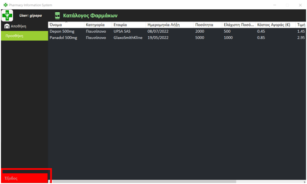

# Project Management

### Για τη διαχείριση μιας φαρμακαποθήκης είναι επιθυμητή η δημιουργία ενός ολοκληρω-μένου συστήματος λογισμικού που θα επιτρέπει τη διαχείρισή της. 

### H εφαρμογή λογισμικού που θα αναπτυχθεί θα έχει τη δυνατότητα:
##### α) Να μπορεί να αποθηκεύσει με τυποποιημένο τρόπο εύκολα όλα τα φάρμακα και τα παραφαρμακευτικά  προϊόντα  και  να  διαχειρίζεται  ένα  σύστημα  αποθήκευσης  που  θα επιτρέπει σε ένα χρήστη ανάλογα με τα δικαιώματα πρόσβασης που θα έχει στο σύστημα να γνωρίζει:
   1)Το υπολειπόμενο στοκ για  φάρμακα ή παραφαρμακευτικά προϊόντα ανά εταιρία -βιομηχανία παρασκευής των προϊόντων αυτών και ανά κατηγορία (π.χ. φάρμακα για την πίεση).
   2)Το ρυθμό πώλησης των φαρμάκων και της κατηγορίας φαρμάκων.
   3)Ειδοποιήσεις όταν ο αριθμός των τεμαχίων από ένα συγκεκριμένο φάρμακο ή παραφαρμακευτικό προϊόν μειωθεί κάτω από ένα ελάχιστο όριο που πρέπει να μπορεί να ρυθμιστεί παραμετρικά.
   4)Πληροφορίες  που  αφορούν  την  ημερομηνία  λήξης  των  φαρμάκων,  το  κόστος αγοράς, την τιμή πώλησης, την ποιότητα τους (πραγματικά φάρμακα ή φασόν).
   5)Αυτόματη κωδικοποίηση / Προϊόν / Κατηγορία / Προμηθευτή.
   6)Πρόβλεψη κερδοφόρων φαρμάκων και παραφαρμακευτικών προϊόντων.
##### β) Να έχει τη δυνατότητα να ενεργοποιήσει μηχανές και διατάξεις στο χώρο της αποθήκης ώστε να είναι δυνατό με ημιαυτόματο τρόπο να γίνεται η συλλογή των φαρμάκων και παραφαρμακευτικών  προϊόντων  για  κάθε  παραγγελία  φαρμακείου  που  πρέπει  να ετοιμαστεί.
##### γ) Να μπορεί να διαχειριστεί παραγγελίες φαρμακοποιών σε φάρμακα και παραφαρμα-κευτικά  προϊόντα  από  ένα  πλήθος  από  διαφορετικούς  πωλητές  που  θα  αμείβονται ανάλογα με τις πωλήσεις τους:
   1)Θα πρέπει κάθε πωλητής να μπορεί να δημιουργήσει το δικό του προσωπικό πελατολόγιο (από φαρμακοποιούς) από τους οποίους θα δέχεται παραγγελίες για προϊόντα.
   2)Η καταχώρηση των φαρμάκων και παραφαρμακευτικών προϊόντων θα πρέπει να γίνεται με τέτοιο τρόπο ώστε να μπορεί να γνωρίζει ανά φάρμακο και φαρμακοποιό τον μηνιαίο και τον ετήσιο τζίρο καθώς και τον αριθμό των τεμαχίων / προϊόν που πουλήθηκαν.
   3)Διαχείριση συστήματος ενημέρωσης της αποθήκης για κάθε νέα παραγγελία ώστε αυτή να μπορεί να ετοιμαστεί από την αποθήκη και ενημέρωση από την αποθήκη όταν αυτή θα έχει ολοκληρωθεί.
   4)Διαχείριση  συστήματος  διανομής  στα  φαρμακεία  από  ένα  ή  περισσότερους διανομείς και ενημέρωση μόλις παραδοθεί η παραγγελία.
##### δ) Να κάνει τιμολόγηση κάθε παραγγελίας πριν αυτή φύγει για διανομή στα φαρμακεία:
   1)Να παρακολουθεί τον ετήσιο τζίρο / φαρμακείο και τον ρυθμό πληρωμής των τιμολογίων.
   2)Να καταχωρεί τα τιμολόγια σε ηλεκτρονική μορφή ώστε να υπάρχει η δυνατότητα αναζήτησής τους / φαρμακείο –φαρμακοποιό και με ημερομηνία.
   3)Να παρέχει στατιστικά στοιχεία για τις ετήσιες πωλήσεις / φαρμακείο / προϊόν και τον συνολικό ετήσιο τζίρο καθώς και τα κέρδη ανάλογα με τα ποσοστά κέρδους / προϊόν.
##### ε) Η εφαρμογή πρέπει να είναι φιλική στο χρήστη.
##### στ) Να επιτρέπει τη διαχείριση από διαφορετικούς χρήστες με συγκεκριμένα δικαιώματα και κωδικούς εισόδου.
